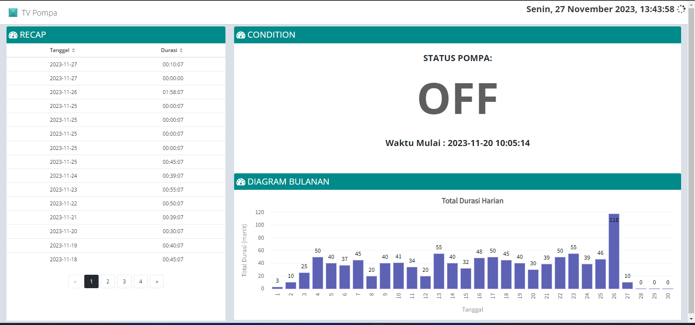
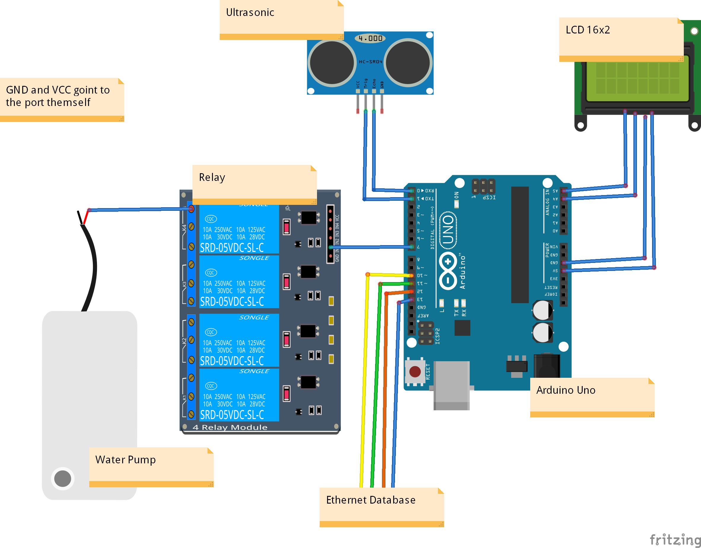

# IoT Pompa Air

## Deskripsi Proyek

Proyek ini adalah implementasi Internet of Things (IoT) yang menggunakan Arduino Uno sebagai perangkat pengendali pompa dan sebuah aplikasi web berbasis Laravel dan Angular sebagai antarmuka pengguna.

## Komponen Utama

1. **Arduino Uno**: Digunakan sebagai mikrokontroler untuk mengontrol dan memonitor status pompa.
2. **Sensor**: Sensor yang digunakan untuk mendeteksi ketinggian air yaitu sensor level air.
3. **Pompa**: Pompa air yang dikendalikan oleh Arduino sesuai dengan kondisi yang diukur oleh sensor.
4. **Aplikasi Web Laravel dan Angular**: Menampilkan data dari Arduino dan memberikan antarmuka pengguna untuk mengontrol pompa.

## Struktur Direktori

- **arduino_code**: Kode Arduino Uno untuk mengontrol pompa dan mengirimkan data ke server.
- **laravel_app**: Aplikasi Laravel sebagai backend untuk menangani data dari Arduino dan menyediakan API.
- **angular_app**: Aplikasi Angular sebagai frontend untuk menampilkan data dan memberikan antarmuka pengguna.
